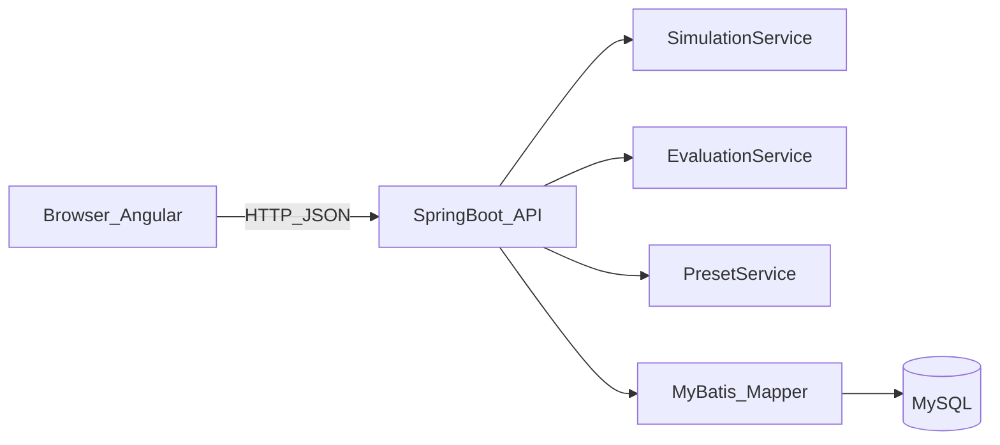

# 系统设计说明

## 1. 总体架构

## 2. 模块职责

### 前端（Angular）
- `simulator.component`：页面编排、状态管理、自动演化调度、接口调用。
- `grid-canvas.component`：网格渲染、点击切换、邻域高亮。
- `rule-editor.component`：规则与邻居类型编辑。
- `control-panel.component`：仿真控制与速度调节。
- `tutorial-panel.component`：选中细胞邻域解释（教学动画文字化）。

### 后端（Spring Boot + MyBatis）
- `SimulationController`：统一接口入口。
- `SimulationService`：生命游戏、Rule30、Rule110 的核心演化逻辑。
- `EvaluationService`：5 个测试场景生成与答案校验。
- `PresetService`：预设模型库输出。
- `SimulationRecordMapper`：演示记录写库（MyBatis XML 映射）。

## 3. 核心数据结构
- `RuleConfig`：模型类型、邻居类型、B/S 参数、Rule 号。
- `SimulationRequest`：当前网格 + 规则配置。
- `SimulationStepResponse`：下一代网格 + 变化数量。
- `EvaluationScenario`：题干、初始态、规则、步数、期望结果。
- `EvaluationResult`：是否正确、提示语、差异数。

## 4. 关键流程

### 4.1 仿真演化
1. 用户在前端配置规则并编辑初始状态。
2. 前端调用 `POST /api/simulation/step`。
3. 后端根据模型类型选择算法并返回下一代网格。
4. 前端刷新画布并记录历史，以支持回退。

### 4.2 学习评测
1. 用户加载预设评测场景。
2. 用户执行若干步仿真得到答案网格。
3. 前端调用 `POST /api/evaluation/check`。
4. 后端对比期望网格并返回正确性与差异数。

## 5. 课程要求映射
- 可视化建模界面：已覆盖网格绘制、规则编辑、初始化配置。
- 交互式仿真控制：已覆盖单步、连续、暂停、重置、回退、代数展示。
- 学习子系统：已覆盖邻域解释与 5 场景评测。
- 进阶点：已覆盖预设模型库（生命游戏/Rule30/Rule110）。
